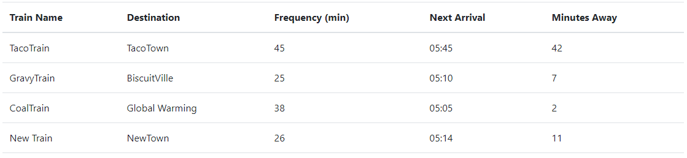
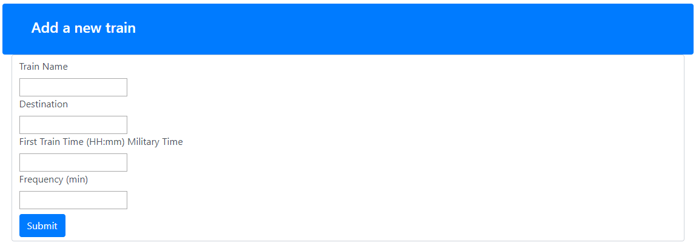

# firebase-assignment
Train-Tracker is an app which allows for train time and frequency entries, and calculates next arrival times.

Train-Tracker is deployed to github, and can be accessed by visiting https://gavinquirk.github.io/Train-Tracker/

The application displays Train Name, Destination, Frequency (min), Next Arrival, and Minutes Away for each train entry

To enter a new train, scroll down and enter into the form: 
  * Train Name
  * Destination
  * First Train Time
    - This MUST be in the correct HH:mm military time format
  * Frequency (min)

  

  * Press Submit to add the new train.
  * The new train will be displayed above in the train times section

